### .NET Introduction
- comparison:
  - Feature                             |                         Responsible Component
  - Syntax error detection before build |                 ✅ Roslyn (C# compiler) in the editor
  - Real-time feedback                  |                       ✅ IntelliSense + Roslyn
  - Build errors                        |                    ✅ C# compiler (during build)
  - Runtime errors                      |                    ✅ CLR (when running the app)

- Short Circuit (&&, ||)
  - true || true || true || true || true || true || true || true || true || true     ---> if first condition is true, no need to check the rest. (it saves execution time)
  - true | true | true | true | true | true | true | true  ---> it will check all of them. even if the first condition is true.

- s1 == s2     ---> it should be false (s1_address is equal s2_address??)

- array_name[2..^2] ---> starting from 2 including all elements until the element before the second one from the last. counting from back starting from 1. the date type of the value 2..^2 is range.

- bounds checking ---> it is made by CLR. it is checking in the runtime whether the indexing is out of bounds or not and if it is, an exception will be thrown.

- void expression:
  - Console.WriteLine("Hello World!");
 
- ??   ---> null coalescing operator

- null reference exception:
  - case: s1.ToUpper(); and s1 is null
  - solution: s1?.ToUpper();  ---> if it is not null, then call ToUpper method otherwise return null.
  - another solution: s1 is null? null : s1.ToUpper();
 
- c++ ---> print then increment
- ++c ---> increment then print

- for is better in performance than for each

- everything in .NET derived from Object datatype

- boxing ---> from value type to reference type
- unboxing ---> from reference type to value type

- PadLeft(8, '0');

- char[] CharArrayName = string_name.ToCharArray();

- default class modifier ---> internal

- Programming Languages that is supported by .NET:
  - C#
  - F#
  - C++
  - VB.NET

---

### Class members:
  - fields ✅
  - constants ✅
  - properties ✅
  - method ✅
  - event ✅
  - operator ✅
  - indexer ✅
  - constructor ✅
  - finalizer ✅
  - nested type ✅

- Accessing constant from a class is in this way: class_name.const_name

- object = instance of a class

- static and const is stored in an area of heap called "high frequency heap"

- (instance vs static) method

---

### Class Types
- Manager Class

---

### Keywords
- var (implicitly-typed variables must be initialized)
  - it is considered as keyword not data type
  - the compiler defines the data type
  - valid usage:
    - var name = "Doha";
    - var age = 25;
    - var x = (int?) null;
    - var y = (string) null;
  - invalid usage:
    - return type = var
    - var age;
    - var age = null;
    - var x = 2; x = "Doha";
- Default keyword
  - for reference type: null
  - for value type: value ... 0, 01/01/0001

---

### Class Keywords
- partial:
  - it allows u to define the same entity (class, struct, ...) more than one time

---

### Naming Conventions:
- interfaces ---> IEnumerable
- exception ---> InvalidAddressException
- public class members ---> Age
- private class members ---> age, _age
- parameters ---> age
- variables in the main method ---> age
- an async function ---> ReadContentAsync()

---

### Exceptions
- what, why and how is exception
- try catch finally
- catch specific exception
- catch multiple exceptions
- exception class
- exception filters
- mocking exception using random class
- custom exception
- random class
- swallow the exception
- ducking the exception (rethrow)

---

### Object
- object = instance
- Employee e1 = new Employee {
      FirstName = "John",
      LastName = "Doe"
  };
- Employee e2 = new Employee {
      FirstName = "John",
      LastName = "Doe"
  };
- Employee e3 = e1;
- if (e1 == e2) // false, two different references to different objects
- if (e1 == e3) // true, same reference to same object

- s1 = "Hello"; s2 = "Hello";
- if(s1 == s2) // True, the compiler compared s1 = s2 in content not in reference

- what if I want to compare content?!
- e1.Equals(e2); // by default it compares the reference but you can override it to compare the content
- e1 == e2; // you can also overload it

- 7.gethashcode(); // 7 but it is different for objects of classes. also, if it is a character, it is hashed to a specific code. use prime numbers to avoid collisions.

---

### Misc
- is vs is not
- var emp = obj as Employee;
  - if it was not able to cast it, it will return null
- name of
- DateVariable.Value.ToString("yy");
- DateTime vs DateTimeOffset vs TimeSpan
- UTC time
- int vs int?
  - int the default value is 0
  - int? the default value is null

---

### Enumeration
- if you have a class you want to iterate over an array in it using the class name

- steps:
  - inherit from IEnumerable
  - you should create GetEnumerator that returns IEnumerator
  - make class Enumerator or in modern way, use yield keyword:
    - IEnumerator is current, movenext, Reset
    - yield return item;

- IComparable:
  - temps.Sort();
    - it will not work. you should inherit from IComparable to implement CompareTo()

---

### Code Documentation
- inline comment
- XML Documentation
  - type only /// and it will write summary tag
  - tags:
    - summary
    - remarks
    - value
    - paramref
    - param
    - list
      - item
      - term
      - description
    - example
      - code
    - returns
    - exception
    - see
  - XML documentation generation
  - external documentation file ... to separate code from documentation ... use include above the code to include XML
  - best practices:
    - anything public should be documented. private maybe
    - don't document too much

---

### Extension Methods
- when it is used?
  - when I need a specific method that is not found in the class like DateTime
- steps:
  - make a file "datetime extensions"
  - it should be inside static class
  - parameter should be preceded with this keyword
  - add the new methods you want there
  - you can call them by:
    - datetimeextensions.methodname(dt);
    - dt.methodnaem(); // modern
- method chaining
- resolve ambiguity
  - if you have an instance method and extension method with the same name, the instance method will not be override

---

### Assemblies
- Assembly = IL
- assembly is called on dll files
- an assembly is the basic unit of deployment in .NET
- .NET framework works only on windows but .NET and .NET core works on any platform
- dll is the assembly code
- exe is the launcher
- in .net framework, the assembly and the launcher is the same file (exe file) but in .NET and .NET core, the assembly is a file (dll file) and the launcher is another file (exe file)
- communication became more easier and faster between assemblies due to metadata
- 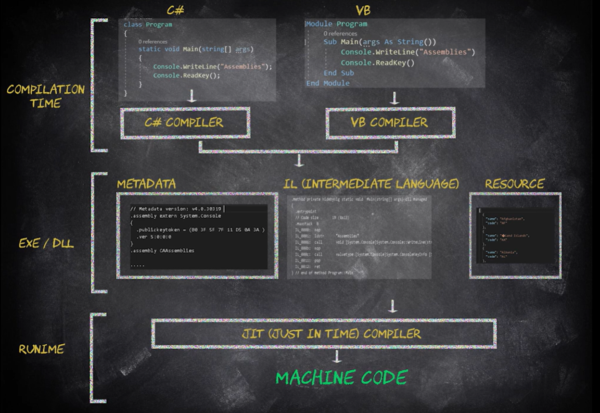
- Ildasm (disassembly) ---> used to convert the DLL/exe to IL code
- Ilasm (assembly) ---> used to convert from IL code to DLL/exe
- typeof(Employee).Assembly ---> it will return the assembly name
- Assembly.GetExecutingAssembly(); ---> it will return the assembly name that is being executed
- Assembly.GetEntryAssembly(); ---> it will return the assembly name that is the entry
- Assembly.GetCallingAssembly(); ---> it will return the assembly name that is the calling
- with for example typeof(DateTime).Assembly.GetName(); you can get any of the following:
  - assembly.Name
  - assembly.CodeBase
  - assembly.Version
- Resource Embedding:
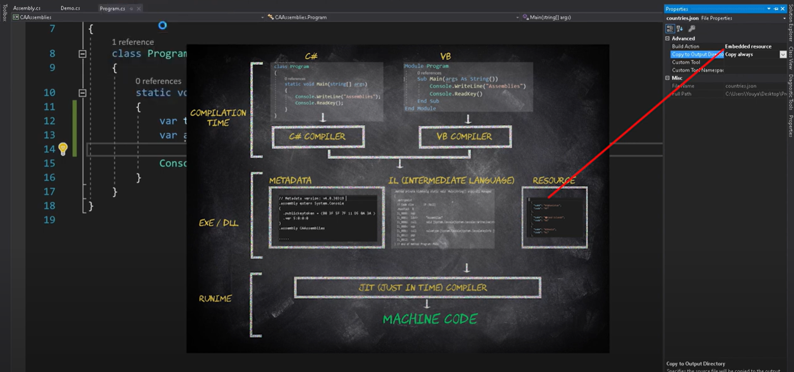
- if you want to publish code on a cloud for the client, you don't publish the source code you publish the dll files (assembly code) and if you used external data (resources) you should embed them (embedded resources)
- to convert the resource to a stream
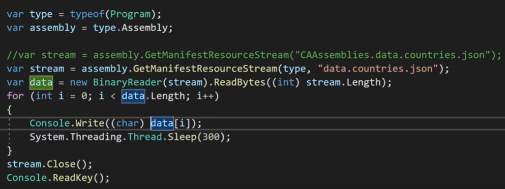

---

### Reflection
- it is an advanced topic
- it is the operation of inspecting metadata and compiled code in the assembly at runtime
- Obtaining Types:
  - DateTime.Now.GetType(); // at runtime
  - typeof(DateTime); // at compile time
  - with GetType:
    - FullName
    - NameSpace
    - Name
    - BaseType
    - IsPublic
    - IsAbstract
    - Assembly
  - with typeof:
    - Name
    - GetNestedTypes()
    - GetInterfaces()
- Instantiating Types:
  - (int) Activator.CreateInstance(typeof(int), variable_name); same as new int(); // this is object handler
  - object_handler_var.unwrap(); // this is an object
- Reflecting Types:
  - MemberInfo[] members = typeof(BankAccount).GetMembers(); // it will return all members except private members ... if you want stuff rather than public you should use BindingFlags enum
  - FieldsInfo[] fields = typeof(BankAccount).Getfields();
  - also, PropertyInfo[] properties (it has GetGetMethod()), EventInfo[] events, ConstructorInfo[] constructors, Attribute
  - another way:
    - MemberInfo[] ctors = typeof(BankAccount).GetMember(".ctor");
- Invoking members:
  - Call ToString() on an object even if you don’t know its type at compile time
- Reflecting Assemblies:
  - it is to load external dll to my project

---

### Attributes
- What, why and how
  - all attributes inherit from Attribute class
  - any attribute is actually a class
  - All attribute class names end with "Attribute"
  - attributes are assigned in assembly at compile time but you access them at run time using reflection
  - attributes isn't inherited by default
- where to apply
  - in ASP .NET
- common attributes
  - obsolete ... it can be used as a warning or an error
  - flags
  - DebuggerDisplay
  - Attribute Usage
    - attribute targets
    - allow multiple
    - inherited
- custom attributes
- attribute usage
- reflection and attributes

---

### Collections - List
- random access
- kept in memory after processing
- contiguous memory
- definition
- methods:
  - Add() O(1)
  - AddRange() O(n)
  - Insert() O(n)
  - InsertRange() O(n)
  - RemoveAt() O(n)
  - RemoveAll() O(n)
  - Remove() O(n)
    - sometimes the elements will not be removed because its hash is different. there is a solution. you should override gethashcode() and Equals()
- properties:
  - Count
  - Capacity
    - capacity is >= count
    - capacity by default starts with 0 then 1, 2, 4, 8, 16, 32, ...

---

### Collections - Dictionary
- random access
- kept in memory after processing
- contiguous memory
- methods:
  - ContainsKey()
  - Add()
- property:
  - key
  - value

---

### Collections - Stack
- real world scenario
  - undo & redo
- order of access
- sequential access
- fast remove/retrieval
- discard after processing
- contiguous memory
- methods:
  - Push()
  - Pop()
  - Peek()
  - TryPeek()
  - TryPop()

---

### Collections - Queue
- order of access
- sequential access
- fast remove/retrieval
- discard after processing
- contiguous memory
- methods:
  - enqueue()
  - dequeue()
  - Peek()
  - TryPeek()
  - TryDequeue()

---

### Collections - LinkedList
- real world example:
  - youtube playlist
- fast remove/retrieval
- sequential access
- kept in memory after processing
- Method:
  - AddFirst()
  - AddLast()
  - AddAfter()
  - AddBefore()
- property:
  - First
  - Last
  - Prev
  - Next
  - Item

---

### Collections - Hash Set
- fast removal/retrieval
- contiguous memory
- kept in memory after processing
- random access
- I mind with key, value is null
- key is unique but not sorted
- it has hash table
- hash based lookups
- no indexing
- methods:
  - Add()
  - UnionWith()
  - IntersectWith()
  - ExceptWith()

---

### Collections - Sorted Set
- fast removal/retrieval
- contiguous memory
- kept in memory after processing
- random access
- key is unique and sorted
- internally linear search
- no indexing
- slower than hash set
- it can sort by default the value types but to sort the reference type you need a sorting mechanism using "IComparable"

---

### String
- methods:
  - PadLeft()
  - EndsWith()
  - Split()
  - trim()
  - ToLower()
  - ToUpper()

---

### DateTime
- ToString()

---

### Stream and I/O
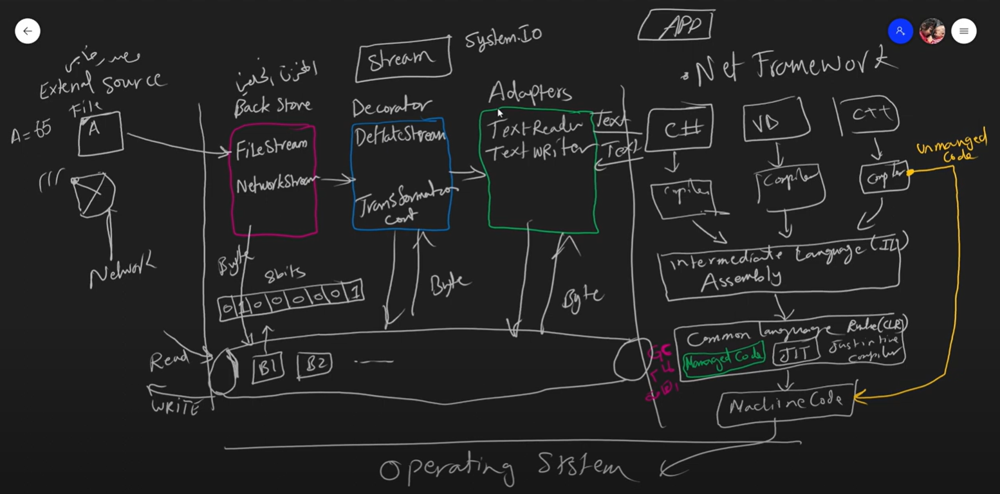
- wrapper or proxy
- HttpClient
  - it inherits from IDisposable. So, it has unmanaged code. So, you need to clean its content by yourself.
  - it is unmanaged code. So, you need to manage it (to clear the garbage) by inheriting from IDisposable interface.
    - you create protected virtual void Dispose (bool disposing)
      - if disposing is true, clear managed and unmanaged code
      - if disposing is false, clear unmanaged and large fields code
    - it is recommended to use try ... catch ... block
    - it is more recommended to use "using"
      - using is converted already to the recommended way
    - more more recommended
      - using with no blocks
    - don't forget the finalizer also
- FileStream (Back Store)
  - file mode:
    - open
    - create
    - openorcreate
  - file access:
    - read
    - write
    - readwrite
  - filestream:
    - can read
    - can write
    - can seek
    - length
    - can timeout
    - position (of the cursor)
  - FileStream.WriteLine(65); // it will write in the file 'A'
- Adapters:
  - it is a wrapper on the file stream. you deal with adapter and it will deal with the file stream.
  - examples:
    - stream writer
    - stream reader
  - file facade operations
    - File.WriteAllLines(path, lines);
    - File.WriteAllText(path, text);
    - File.ReadAllText(path, text);
    - File.ReadAllLines(path, text);
- Decorator (Deflate Stream):
  - it is used to compress data
  - Compression Mode:
    - Compress
    - Decompress

---

### Nuget package manager
- the package is the source code after build. it is the smallest unit you can deploy.
- meta data + (IL / assembly code / dll / exe / compiled code)
  - in case it is library, dll
  - in case it is console project, dll + exe
  - meta data:
    - code writer
    - company owner
    - code version
    - and so on...
- it is the official package manager for .NET. it is easy to share packages. So, don't reinvent the wheel.
- nuget.org
  - a platform where u can publish and find all the packages of .NET
  - each package has its unique id
  - package examples:
    - Humanizer
- Dependencies:
  - if u want a specific library, the package manager will need to install implicitly specific libraries
- after installing the package in the project where to find it?
  - in the bin folder, u will find dll, exe files
  - also the .NET made a reference from the package to the project
  - u can use a specific version also
- u can create a package and pack it and publish it on nuget.org
- debug mode (for development) vs release mode (for production)
  - #if Debug #endif

---

### Threading
- each process (specially simple .NET program) has:
  - unique process ID
  - single thread by default
  - the thread is the stuff who deals with the CPU
  - 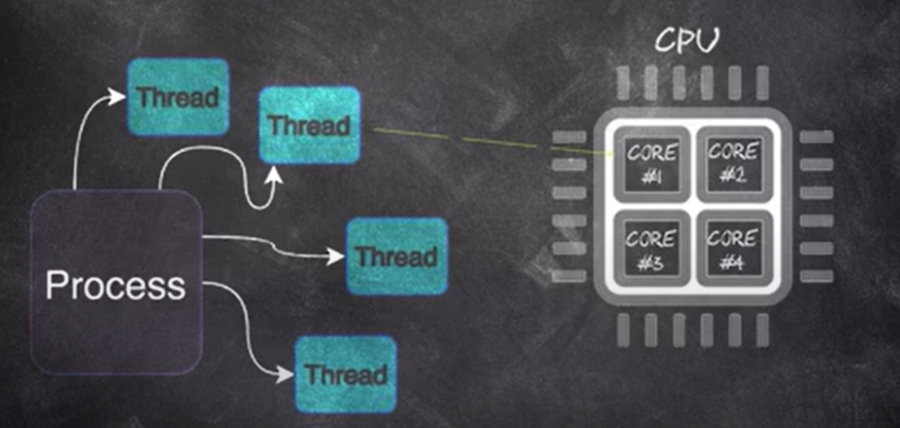
- Process class (it will be different each time you run the program):
  - GetCurrentProcess().Id;
- Thread class (it will be different each time you run the program):
  - Sleep();
  - CurrentThread;
  - CurrentThread.Name;
  - CurrentThread().ManagedThreadId; // by default it is 1
  - CurrentThread().IsThreadPoolThread;
  - GetCurrentProcessorId(); // computer has cores (physical) and logical processors
  - each thread can be assigned to different processors in the same run due to thread scheduler.
  - Thread.CurrentThread.IsBackground // by default all threads are foreground
  - ThreadState
    - Unstarted
    - Running
    - Stopped
- Sequential Synchronous Approach (traditional way, top down approach)
- Create a thread
  - there is a threads menu in the IDE
  - Thread t1 = new Thread(method_address);
- (foreground vs background) thread
  - foreground keeps the program running until all of them finish
  - background don't keep the program alive on their own. they will be terminated immediately after all the foreground threads finished
- The two threads run in parallel. Perhaps they are too short and accidentally finish too fast. you are at the mercy of the thread scheduler if one thread happens to finish before the schedular decides, it is time to run the other thread.
- Start a thread:
  - t1.Start();
- Joining a thread (waiting for it to finish):
  - t1.Join();
- Race Conditions:
  - it is a scenario where the outcome of the program is affected because of timing
  - solution:
    - use lock keyword
      - this lock will be unlocked after thread1 finishes and then thread2 locks the lock
- Deadlock:
  - it is a situation where two or more threads are frozen in their execution because they are waiting for each other to finish
  - Solution:
    - Monitor class
      - Monitor.TryEnter(object, timeout);
      - Monitor.Exit(object);
    - order them using Id
- Thread Pool
  - thread has overhead in time and memory
  - a thread pool is a pre created recyclable threads
  - helps mitigate the issue of performance be reducing the number of threads.
  - you can't name a thread here
  - threads here are in background
  - ideal for a short running process
  - ways:
    - ThreadPool.QueueUserWorkItem(new WaitCallback(Print));
    - Task.Run(Print);

---

### Asynchronous Programming & Tasks
- Task:
  - it is a wrapper of thread. So, it is highly recommended to use abstraction (Task)
  - you can find it in System.Threading.Tasks
  - Task is a background, pooled thread
  - it can return a value (an advantage over the thread)
  - Task.Run();
  - Task.Wait();
  - Task.Result; = Task.GetAwaiter().GetResult(); // it blocks the thread until result is ready
- Why task over thread:
  - 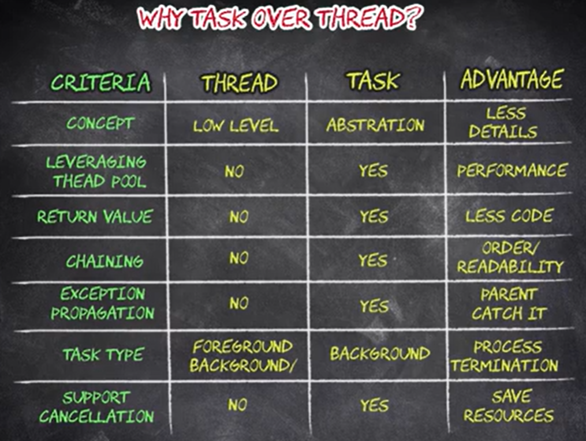
- Task return value:
  - task class can be non generic and it can be generic (return type)
- Long Running Tasks:
  - 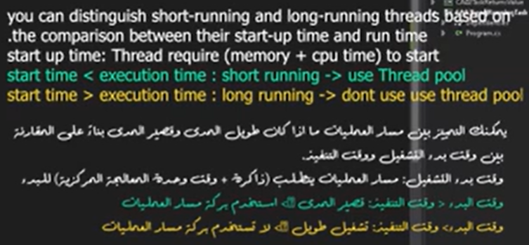
  - Task.Factory.StartNew(); // it will start a task but not from the thread pool but it is still a background
- exception propagation:
  - the exception propagates from one method to another method up the call stack until it's caught
  - so if we have an exception not handled in the child thread, it will propagate until reaching the parent thread
- Task Continuation methods
  - GetAwaiter method and oncomplete
  - ContinueWith();
- Task.Delay() vs Thread.Sleep()
  - Thread.Sleep(); blocks the thread so it's await
  - Task.Delay(); doesn't block the thread so it's async. if you want to block it, use Task.Delay().GetAwaiter().OnCompleted();
- sync vs. async:
  - 
  - 
- Asynchronous Function:
  - wait() vs. await
  - 
- Cancellation Token:
  - CancellationTokenSource class
    - method - 1:
      - Cancel();
      - Token.IsCancellationRequested;
    - method - 2:
      - Token.ThrowIfCancellationRequested();
- Report a progress from Async function:
  - Action class
- Combinator:
  - WhenAny()
  - WhenAll()
- Task-Based Asynchronous Pattern:
  - 
- Concurrency vs Parallelism:
  - 
  - Parallel.ForEach();
  - list_name.Process(); // concurrency

---

### Serialization
- it is the process of converting the state of an object into a form that can be persisted or transported. (memory, file or database)
- reserialization:
  - 
  - binaryformatter is the faster in the processing
    - 
- XML Serialization and Deserialization:
  - XmlSerializer(object_name.GetType()); class
    - Serialize()
    - Deserialize()
  - StringWriter class
    - it is a wrapper of string class to make the string mutable
  - XmlWriter class
    - Create()
  - XmlWriterSettings class
  - File class
    - WriteAllText();
    - ReadAllText();
  - TextReader class
  - StringReader class
- Binary Serialization and Deserialization:
  - MemoryStream class
    - Flush();
    - Position;
  - Convert.ToBase64String();
  - BinaryFormatter class
    - Serialize()
    - Seek()
    - Deserialize()
  - Serializable attribute
  - NotSerialized attribute
- JSON Serialization and Deserialization:
  - using newton soft package
  - modern approach using JSON.NET:
    - JsonSerializer class
      - Serialize()
    - JsonSerializerOptions class
- HTTP client and JSON:
  - if u have a json and u want to deserialize, u need to create a class
  - HttpClient class
    - GetStringAsync()

---

### Yield and ForEach keywords
- 
- CLR Execution Model:
  - 
  - it is an execution environment that converts the code to binary code
- foreach is convert by CLR to an enumerator method
- if you deal with array, use for
- if you deal list, collection, use for each
- if you used array with for each, the CLR will convert the for each to for
- sometimes foreach maybe faster than for
- yield keyword is used when
  - u want a function return element by element not the whole elements one shot
  - so yield is considered as enumerator that saves a specific state from state machine
  - yield return value;
  - yield break;
  - where to use it:
    - operator overloading
    - get property
    - normal method
  - can't use it:
    - anonymous method
  - considered as lazy evaluation

---

### Record
- (Reference-based vs Value-based) equality
- object hash code
  - if e1 and e2 objects from a class have the same content, hash code will still be different
  - if e1 and e2 objects from a struct have the same content, hash code will be the same
- override equals
- override GetHashCode
  - to avoid collisions, use prime numbers
  - collisions = when two different objects have the same hash code. this is wrong. So, u need to build a strong enough hash algorithm
  - modern approach:
    - HashCode.Combine(Member1, Member2, ...);
  - u can support equals method using IEquatable interface
    - u can use it with class and struct (very preferred to use it with struct)
- override operators like ==
- init only setters
  - using init keyword in the property, u can only set values while instantiating the object
- Override ToString()
- Record:
  - it is a reference type
  - it will implicitly override equals, implement IEquatable, GetHashCode, ==, !=, ToString
  - is it immutable or mutable?
    - it is mutable
- Positional Record:
  - immutable by default
  - var (x, y) = object_name; // deconstruction
- Struct record
  - it is a value type
  - to make it immutable:
    - add readonly keyword
- with expression:
  - var p2 = p1 with {X = 4};

---

### Top Level Statement
- Main method forms
  - static void Main ()
  - static void Main (string[] args)
  - static int Main ()
  - static int Main (string[] args)
  - static async Task Main (string[] args)
  - static async Task<int> Main (string[] args)
- top level statement starts from .NET 6
  - which type will it use implicitly then??
    - depends on the scenario. it is smart enough to decide
- rules:
  - you should put any namespace, class after the top level statement
  - any method you define is local in the main method. So, you can't give it an access specifier
- file-scoped namespace
- you can use alias with using keyword
- you can use using static System.Math
- global using System.Text;
  - should be in the first line in the project
- implicit usings
  - <ImplicitUsings>enabled</ImplicitUsings>
  - implicitly using System; and other namespaces
  - you can find them in obj -> debug -> .net x -> global namespace .g .cs
  - global::System; // it means if you named namespace System, the priority is for the System of .NET
  - u can remove a specific namespace using item group

---

### Null
- invention of Tony Hoar. He is regretting up till now :).
- int num1 = text; // will give error in compile time
- int num1 = int.Parse(text); // will give error in run time
- referencing vs dereferencing
- you can define a nullable value type
  - Nullable
  - int?
  - u can use HasValue property instead of is not null
  - Nullable<int> mark8 = new (); // will return 0 not null. be careful
- nullable reference features:
  - they are features related to reference value types like string that give warnings in compile time
  - to enable:
    - <Nullable>enable</Nullable>
  - has compile time effect only (it is not converted to IL)
    - avoid null reference exception
    - string name; // non-nullable
    - string? name; // nullable
- Warning as Errors tag
- Warnings not as Errors Tag
- Compiler static analysis:
  - the compiler will detect in compile time whether it is not null or may be null
- Compiler doesn't trace called method:
  - sometimes a compiler doesn't enter a method and see from its content whether the value can be null or not. so it maybe give a wrong warning. you can ignore this warning given by the compiler using the attribute [MemberNotNull(nameof(member_name))].
- ?? ---> to check if some value is null
- nullable value annotations:
  - string name = null!;
  - u can use it when:
    - don't care handle exception
    - u do unit testing
    - u know value can not be null
  - var st3 = new Student(); // it is nullable
- Nullable and Generics
- struct and arrays
  - compiler doesn't give warnings when:
    - struct contains reference value type
    - array contains reference value type
- nullable context:
  - Green Field project
    - a project I develop from scratch
  - legacy code
  - active project
  - 
  - you can enable and disable along one file only using #nullable
    - #nullable enable annotations
    - 

---

### String
- How Data is stored?
  - data is stored in binary format on hard disk and is load in memory in hexadecimal format
  - binary format = ASCI table
  - Carriage return = Enter
  - Line Feed = go to the first of the line
- ASCI vs Extended ASCI
  - ASCI = 7 bits + 1 parity check bit
  - Extended ASCI = 8 bits
- Unicode
  - it absorbs up to 1M chars but it holds for now 100_000 chars, no need for the rest. ASCI is the first 128.
- Environment class
- Encoding class
  - UTF8
  - UTF16
  - ,...
- String Instantiation
  - string str = new string(array_of_letters);
  - new string('M', 6);
  - using pointer to signed byte
  - IndexOf(), Subset()
  - using format:
    - 
  - using verbatim string interpolation
  - using raw string
- unicode and string comparison:
  - \u0061 ---> a way to write a char in unicode
  - using stringcomparison.CurrentCulture
- string intern pool:
  - string name, address of what it reference in the stack and the object in the heap and another piece of memory also called intern pool (it is an advantage for string only)
  - 
  - string literal vs string object
    - literal = "Metigator";
    - object = new string ("Metigator");
    - 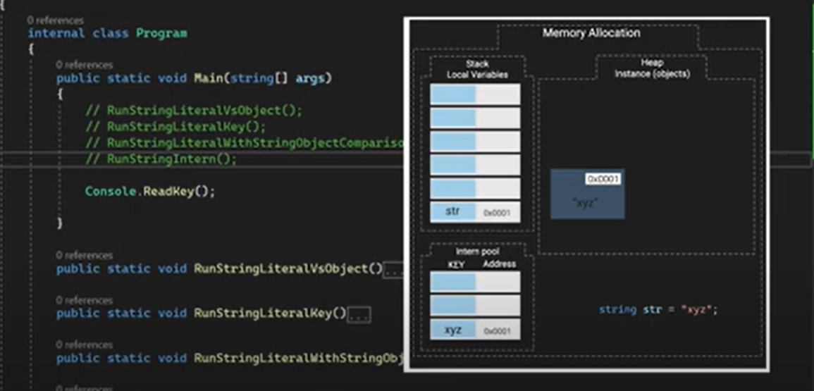
    - 
    - 
    - 
- Methods:
  - CopyTo()
  - Compare()
  - Contains()
  - StartsWith()
  - EndsWith()
  - IndexOf()
  - Format()
  - IsNullOrEmpty()
  - IsNullOrWhiteSpace()
  - Insert()
  - Replace()
  - Remove()
  - ToUpper()
  - ToLower()
  - ToLowerInvariant()
  - ToUpperInvariant()
  - Trim()
  - TrimStart()
  - TrimEnd()
  - ToCharArray()
  - Split()
  - Join()

---

### String Builder
- 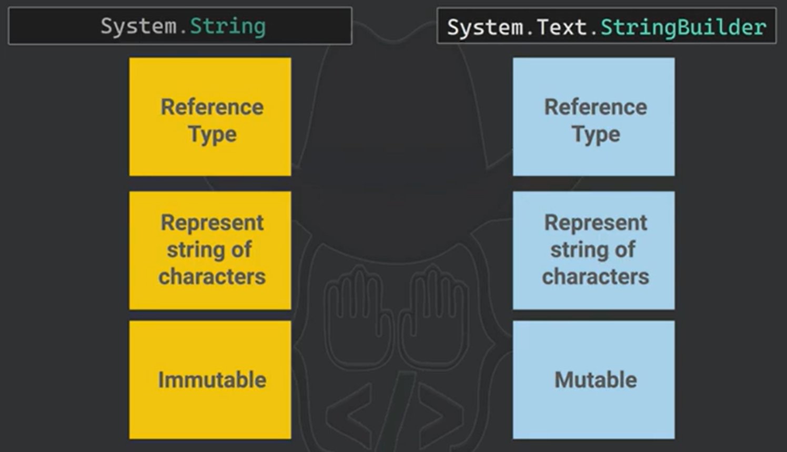
- 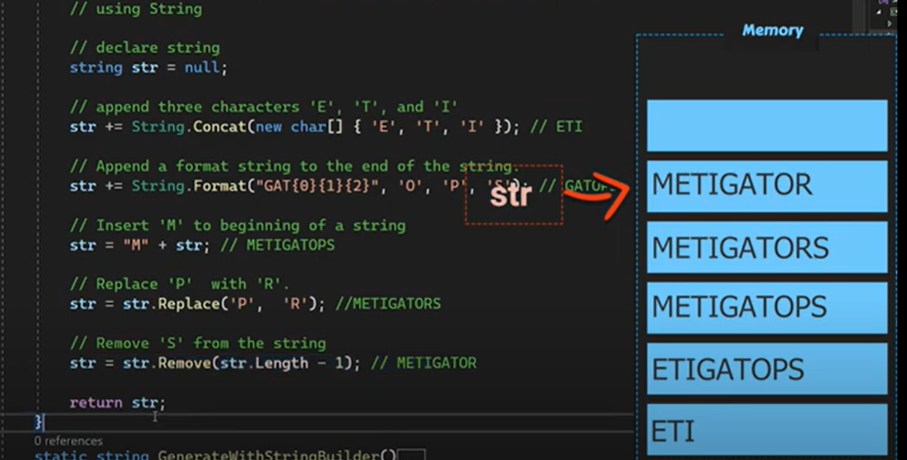
- 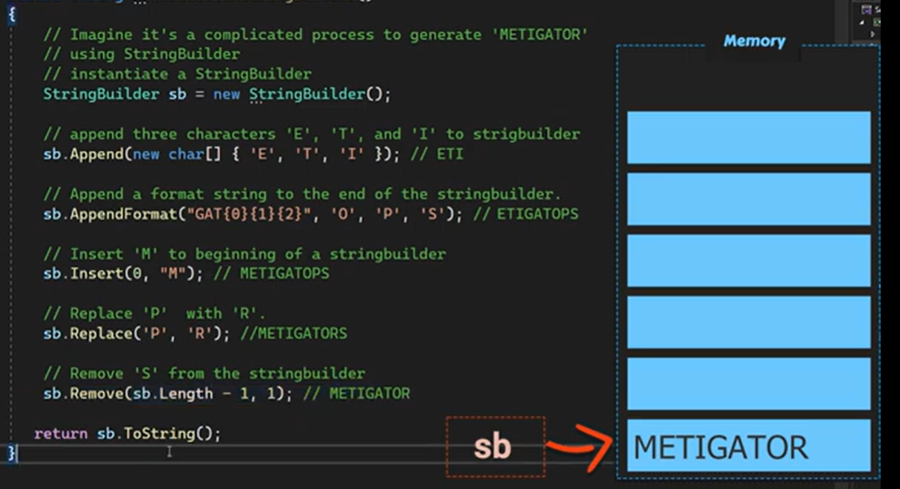
- string builder how it works:
  - string builder is an array of characters
- methods and properties:
  - ToString()
  - Length
  - Capacity // by default start from 16
  - MaxCapacity // by default it has a maximum number
  - 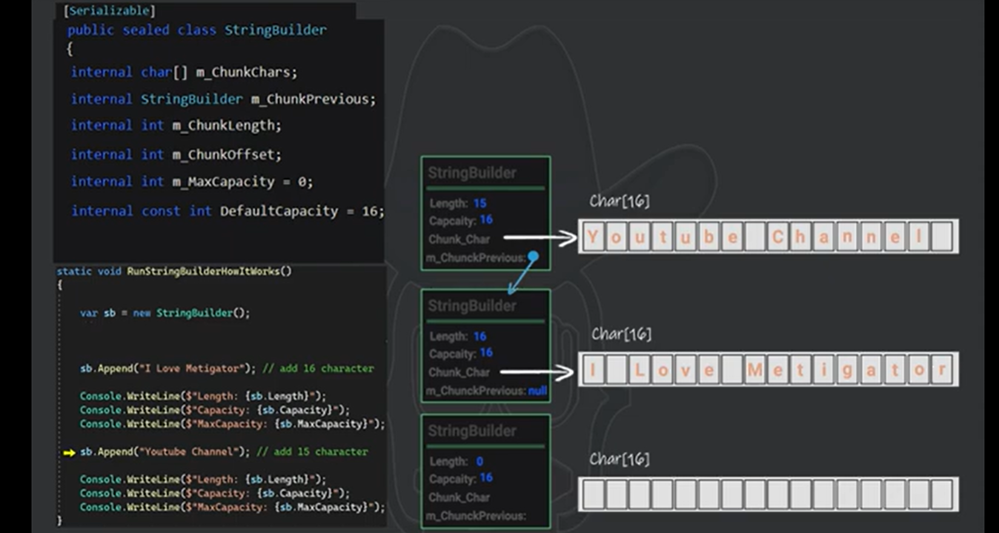
- string builder instantiation:
  - stringBuilder("Metigator", 4); // capacity here can't be 4 and it will not be 16, it will be 9
- Methods:
  - string builder allows methods chaining
  - Append()
  - AppendJoin()
  - AppendFormat()
  - AppendLine()
  - Insert()
  - Replace()
  - Remove()
  - Clear()
  - GetChunks()
  - EnsureCapacity()
  - CopyTo()
  - indexing [] // not recommended, time complexity can reach up to n^2. if it is a small object, O(n)

---

### Tuple
- jagged array is the only type that its elements isn't stored contiguously
- immutable
- strongly typed
- you can return more than one value using out keyword or returning an object
- Tuple Class:
  - with it, u can return more than one value
  - two methods of creation:
    - Tuple.Create();
    - using constructor
    - using new
  - equality:
    - Equals()
- ValueTuple Struct:
  - creation
    - Create()
    - implicit names
    - explicit names
    - deconstruction (unpack):
      - (string x, string y) = tuple5;
- ValueTuple vs Tuple:
  - value tuple has higher performance (value type)
  - value tuple is more readable and maintainable
  - tuple is better in dealing with big data
  - tuple is better in applying oop concepts (reference type, class)